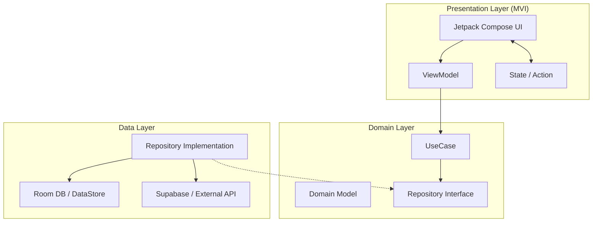

# LogE (Log Emotion)


**LogE**는 사용자의 일상과 감정을 기록하고, 이를 데이터 기반 통계로 시각화하여 자신의 마음을 더 깊이 이해하도록 돕는 안드로이드 애플리케이션입니다.  

---

## 📌 프로젝트 소개 (Project Overview)

LogE는 단순한 일기장을 넘어, 사용자가 하루의 감정을 기록(**Log E**motion)하고 분석할 수 있는 개인화된 감정 분석 도구입니다. 직관적인 UI와 아름다운 차트, 그리고 홈 화면 위젯을 통해 일상의 기록을 습관화할 수 있도록 돕습니다.

---

## 🛠 기술 스택 (Tech Stack)

### 🏗 Architecture & Design Pattern
- **Clean Architecture**: Presentation, Domain, Data 레이어의 엄격한 분리로 비즈니스 로직 보호 및 테스트 용이성 확보
- **MVI (Model-View-Intent)**: 단방향 데이터 흐름을 통한 예측 가능한 상태 관리
- **Hilt (Dependency Injection)**: 표준화된 의존성 주입 체계 구축

### 💻 Languages & Frameworks
- **Kotlin (v2.3.0)** & **Coroutines/Flow**: 강력한 비동기 프로그래밍 및 리액티브 프로그래밍 구현
- **Jetpack Compose (Material3)**: 선언형 UI를 활용한 미려하고 역동적인 사용자 인터페이스
- **Jetpack Glance**: 홈 화면 위젯 구현

### 💾 Data & Network
- **Supabase (Auth, Postgrest)**: 서버리스 환경에서 실시간 데이터베이스 및 인증 시스템 구축
- **Room Persistence Library**: 오프라인 사용을 위한 데이터 캐싱 및 로컬 영속성 관리
- **Ktor Client & Retrofit2**: 효율적인 네트워크 통신 및 API 연동
- **Kotlinx Serialization**: 빠르고 안전한 JSON 직렬화

### ⚡ Libraries & Tools
- **Vico**: 고도화된 커스텀 차트를 이용한 감정 통계 시각화
- **Coil**: 이미지 로딩 최적화
- **WorkManager**: 백엔드 동기화 및 알림을 위한 효율적 배경 작업 관리
- **Timber**: 체계적인 로깅 시스템
- **Testing**: JUnit4, Espresso, Mockk를 활용한 유닛 및 UI 테스트

---

## 📦 아키텍처 구조 (System Architecture)



---

## ✨ 주요 기능 (Key Features)

- **Timeline Log**: 타임라인 형태의 홈 화면에서 과거의 감정 기록을 한눈에 조회
- **Emotional Writing**: 그날의 기분, 원인, 상세 내용을 쉽고 빠르게 기록 (AI 기반 분석 연동 지원 계획)
- **Deep Analytics**: 주간/월간 감정 변화 추이 및 선호하는 활동/장소 등 통계 제공
- **Live Widget**: 앱을 열지 않고도 홈 화면에서 현재 상태를 확인하고 즉시 기록
- **Cloud Sync**: Supabase를 통한 다중 기기 데이터 동기화 및 보안 로그인

---

## 🚀 시작하기 (Getting Started)

### 사전 요구 사항
- Android Studio Ladybug 이상
- JDK 17 이상
- Supabase 프로젝트 (URL 및 API Key 필요)

### 설정 방법
1. 프로젝트 루트에 `local.properties` 파일을 생성하거나 수정합니다.
2. 아래의 키 값을 추가합니다:
   ```properties
   SUPABASE_URL="YOUR_SUPABASE_PROJECT_URL"
   SUPABASE_KEY="YOUR_SUPABASE_ANON_KEY"
   ```
3. Gradle Sync를 실행한 후 빌드를 진행합니다.

---

## 💎 Technical Charm Points (핵심 경쟁력)

- **엄격한 Clean Architecture 준수**: 코드 간 결합도를 낮추고 모듈별 독립적인 테스트 환경 구축
- **서버리스 백엔드 최적화**: Supabase를 적극 활용하여 백엔드 인프라 구축 비용 절감 및 개발 생산성 극대화
- **데이터 시각화 역량**: Vico 라이브러리를 프로젝트 요구사항에 맞게 커스텀하여 수준 높은 통계 UI 구현
- **배경 작업 관리**: WorkManager를 통해 데이터 무결성을 보장하는 지능형 동기화 시스템 구현

---

## 📂 패키지 구조 (Package Structure)

```
com.devhjs.loge
├── core             # DI, Common Utilities, Shared Components
├── data             # Repository Implementation, DataSources (Remote/Local)
├── domain           # UseCases, Pure Models, Repository Interfaces
└── presentation     # ViewModel, Screens (Home, Write, Stat, Setting, etc.)
```
