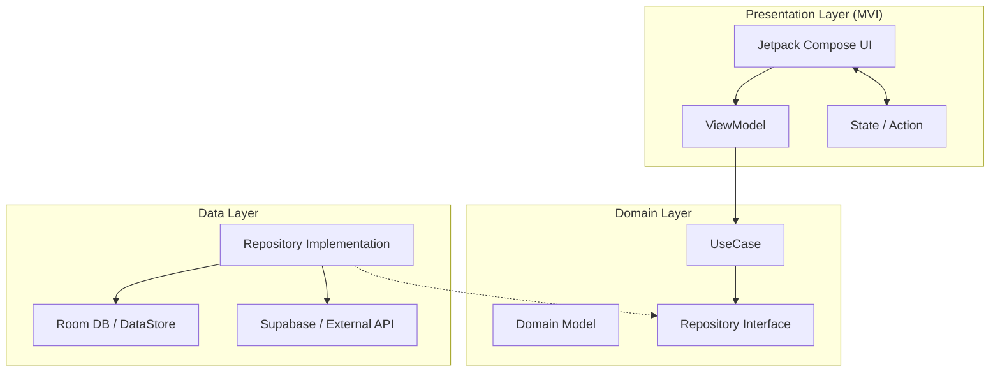
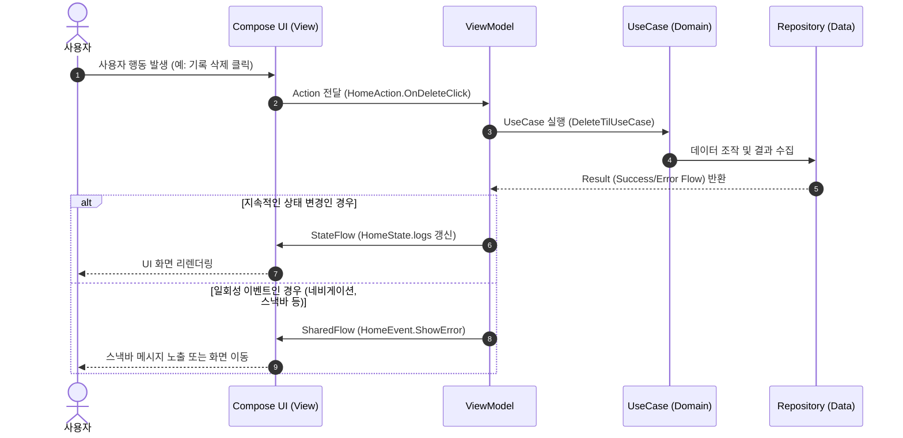

# LogE (Log Emotion)


**LogE**는 사용자의 일상과 감정을 기록하고, 이를 데이터 기반 통계로 시각화하여 자신의 마음을 더 깊이 이해하도록 돕는 안드로이드 애플리케이션입니다.  

---

## 📌 프로젝트 소개 (Project Overview)

LogE는 단순한 일기장을 넘어, 사용자가 하루의 감정을 기록(**Log E**motion)하고 분석할 수 있는 개인화된 감정 분석 도구입니다. 직관적인 UI와 아름다운 차트, 그리고 홈 화면 위젯을 통해 일상의 기록을 습관화할 수 있도록 돕습니다.

---

## 🛠 기술 스택 (Tech Stack)

### 🏗 Architecture & Design Pattern
- **Clean Architecture**: Presentation, Domain, Data 레이어의 엄격한 분리로 비즈니스 로직 보호 및 테스트 용이성 확보
- **MVI (Model-View-Intent)**: 단방향 데이터 흐름을 통한 예측 가능한 상태 관리
- **Hilt (Dependency Injection)**: 표준화된 의존성 주입 체계 구축

### 💻 Languages & Frameworks
- **Kotlin (v2.3.0)** & **Coroutines/Flow**: 강력한 비동기 프로그래밍 및 리액티브 프로그래밍 구현
- **Jetpack Compose (Material3)**: 선언형 UI를 활용한 미려하고 역동적인 사용자 인터페이스
- **Jetpack Glance**: 홈 화면 위젯 구현

### 💾 Data & Network
- **Supabase (Auth, Postgrest)**: 서버리스 환경에서 실시간 데이터베이스 및 인증 시스템 구축
- **Room Persistence Library**: 오프라인 사용을 위한 데이터 캐싱 및 로컬 영속성 관리
- **Ktor Client & Retrofit2**: 효율적인 네트워크 통신 및 API 연동
- **Kotlinx Serialization**: 빠르고 안전한 JSON 직렬화

### ⚡ Libraries & Tools
- **Vico**: 고도화된 커스텀 차트를 이용한 감정 통계 시각화
- **Coil**: 이미지 로딩 최적화
- **WorkManager**: 백엔드 동기화 및 알림을 위한 효율적 배경 작업 관리
- **Timber**: 체계적인 로깅 시스템
- **Testing**: JUnit4, Espresso, Mockk를 활용한 유닛 및 UI 테스트

---

## 📦 아키텍처 구조 (System Architecture)


```mermaid
graph TD
    subgraph "Presentation Layer (MVI)"
        UI["Jetpack Compose UI"]
        VM["ViewModel"]
        State["State / Action"]
    end

    subgraph "Domain Layer"
        UC["UseCase"]
        Model["Domain Model"]
        RepoIntf["Repository Interface"]
    end

    subgraph "Data Layer"
        RepoImpl["Repository Implementation"]
        Local["Room DB / DataStore"]
        Remote["Supabase / External API"]
    end

    UI <--> State
    UI --> VM
    VM --> UC
    UC --> RepoIntf
    RepoImpl -.-> RepoIntf
    RepoImpl --> Local
    RepoImpl --> Remote
```

---

## 🔄 데이터 흐름 (MVI Data Flow)

LogE는 데이터의 단방향 흐름(Unidirectional Data Flow)을 보장하기 위해 **MVI (Model-View-Intent)** 패턴을 준수합니다.


```mermaid
sequenceDiagram
    autonumber
    actor User as 사용자
    participant UI as Compose UI (View)
    participant VM as ViewModel
    participant UC as UseCase (Domain)
    participant Repo as Repository (Data)

    User->>UI: 사용자 행동 발생 (예: 기록 삭제 클릭)
    UI->>VM: Action 전달 (HomeAction.OnDeleteClick)
    VM->>UC: UseCase 실행 (DeleteTilUseCase)
    UC->>Repo: 데이터 조작 및 결과 수집
    Repo-->>VM: Result (Success/Error Flow) 반환
    alt 지속적인 상태 변경인 경우
        VM->>UI: StateFlow (HomeState.logs 갱신)
        UI-->>User: UI 화면 리렌더링
    else 일회성 이벤트인 경우 (네비게이션, 스낵바 등)
        VM->>UI: SharedFlow (HomeEvent.ShowError)
        UI-->>User: 스낵바 메시지 노출 또는 화면 이동
    end
```

1. **User Action**: 사용자가 UI에서 발생시킨 이벤트는 `Action` 객체로 포장되어 ViewModel로 전달됩니다.
2. **Business Logic**: ViewModel은 비즈니스 요구사항에 따라 `UseCase`를 실행합니다.
3. **Data Source Access**: Repository는 Room DB 혹은 Supabase API에 접근하여 데이터를 생성/수정/삭제합니다.
4. **State & Event Emission**:
   - 화면에 계속해서 반영되어야 하는 UI 상태 정보는 `StateFlow`를 통해 `State` 객체로 UI에 전달됩니다.
   - 단 한 번만 발생해야 하는 이벤트(예: 화면 이동, 에러 스낵바)는 `SharedFlow`를 통해 `Event` 객체로 방출됩니다.
5. **UI Rendering**: UI는 변경된 `State`에 반응하여 리렌더링을 진행합니다.

---

## 🔑 DI 구조 (Hilt Dependency Injection)

Dagger-Hilt를 기반으로 한 체계적인 의존성 주입을 통해 객체의 생명주기를 안전하게 관리하고 결합도를 낮췄습니다. `core/di` 패키지 내부에서 관리되는 주요 모듈들은 다음과 같습니다.

| Hilt 모듈명 | 수명 주기 (Scope) | 역할 및 제공 대상 |
| :--- | :--- | :--- |
| `DatabaseModule` | `SingletonComponent` | Room DB (`LogEDatabase`) 및 각 테이블 DAO (`TilDao`, `UserDao`, `MonthlyReviewDao`) 제공 |
| `SupabaseModule` | `SingletonComponent` | Supabase Client 및 Auth, Postgrest 서버리스 API 연동 클라이언트 제공 |
| `NetworkModule` | `SingletonComponent` | API 연동을 위한 Ktor Client 및 Retrofit 인스턴스 제공 |
| `RepositoryModule` | `SingletonComponent` | 도메인 레이어의 인터페이스와 데이터 레이어의 구현체를 매핑 및 제공 |

> [!TIP]
> **Flavor별 조건부 바인딩(Mock vs Production)**:  
> `RepositoryModule`에서는 빌드 Flavor가 `dev`일 경우 데이터 통신이나 API 없이 즉시 UI 개발과 단위 테스트가 가능한 Mock 구현체(`MockRepositoryImpl`, `MockAiRepositoryImpl`)를 제공하고, `prod`일 경우에는 실제 Supabase 및 로컬 DB 기반의 구현체를 조건부 주입합니다.

---

## ✨ 주요 기능 (Key Features)

- **Timeline Log**: 타임라인 형태의 홈 화면에서 과거의 감정 기록을 한눈에 조회
- **Emotional Writing**: 그날의 기분, 원인, 상세 내용을 쉽고 빠르게 기록 (AI 기반 분석 연동 지원 계획)
- **Deep Analytics**: 주간/월간 감정 변화 추이 및 선호하는 활동/장소 등 통계 제공
- **Live Widget**: 앱을 열지 않고도 홈 화면에서 현재 상태를 확인하고 즉시 기록
- **Cloud Sync**: Supabase를 통한 다중 기기 데이터 동기화 및 보안 로그인

---


## 💎 Technical Charm Points (핵심 경쟁력)

- **엄격한 Clean Architecture 준수**: 코드 간 결합도를 낮추고 모듈별 독립적인 테스트 환경 구축
- **서버리스 백엔드 최적화**: Supabase를 적극 활용하여 백엔드 인프라 구축 비용 절감 및 개발 생산성 극대화
- **데이터 시각화 역량**: Vico 라이브러리를 프로젝트 요구사항에 맞게 커스텀하여 수준 높은 통계 UI 구현
- **배경 작업 관리**: WorkManager를 통해 데이터 무결성을 보장하는 지능형 동기화 시스템 구현

---

## 📦 모듈 및 패키지 구조 (Module & Package Structure)

본 프로젝트는 현재 단일 모듈(`:app`)로 설계되어 있으나, Clean Architecture 아키텍처 원칙에 따라 레이어 간의 디커플링이 명확하게 분리되어 있어 향후 멀티 모듈 멀티플랫폼 환경으로의 마이그레이션이 용이합니다.

```
com.devhjs.loge
├── core             # DI, 공통 유틸리티(DateUtils 등), 공통 UI 컴포넌트
├── data             # Repository 구현체, Data Sources(Room DB, Supabase 원격 DB)
├── domain           # 비즈니스 로직(UseCase), 순수 도메인 모델, Repository 인터페이스(의존성 역전 적용)
└── presentation     # ViewModel, 화면 구현체(Home, Write 등), MVI 상태 관리 컴포넌트
```
